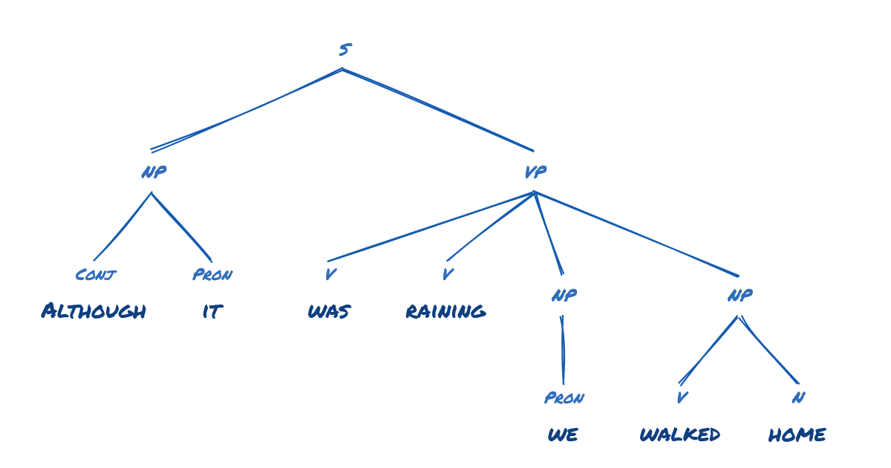

# Syntax Tree

Type a sentence and watch its phrase-structure tree draw itself downward, in
the hand of a whiteboard marker. Browser-only, one HTML file, no build step,
no language model.

[](LICENSE)

[Try Syntax Tree](https://datapoems.io/datavis/syntax/) · [Luke Steuber](https://lukesteuber.com/)



## What it is for

A quick sketch of constituency structure for a classroom, a tutoring session,
or a slide. You type the sentence, the app tags it, folds the tags into a
simplified constituency grammar, and draws the tree as rough SVG. Download the
tree as a PNG or share a link that opens the same diagram.

It is not a parser you should cite. The About panel in the app says the same
thing: a legible toy model, not a linguist. Ambiguous words get a tap target
when the tagger has a plausible alternate reading, so you can correct a noun
the tagger read as a verb and watch the tree redraw.

## Using it

- **Type** a sentence and press Enter, or pick one of the 25 example
  sentences. Each example is a button, so Tab reaches them.
- **Surprise me** diagrams a random example.
- **Change diagram style** cycles six looks: board, chalk, marker, paper,
  sharpie, and midnight. `?theme=board` (or any of the six) opens the app in
  that style.
- **Download tree PNG** exports the current diagram at social-card size.
- **Share this sentence** uses the Web Share API where the browser has it, and
  copies a link otherwise. Shared links open through `share/<theme>/`, which
  carries a preview card for the style and then loads the app.
- **Show full sentence** opens the sentence at reading size when the tree is
  wide enough to shrink it.

Keyboard users can reach every control. Status changes are announced through a
polite live region. Reduced-motion settings turn off the draw-in animation and
keep everything else.

## How the parse works

1. [compromise](https://github.com/spencermountain/compromise) tokenizes the
   sentence and assigns part-of-speech tags.
2. The app collapses those tags into a small constituency grammar: noun
   phrases, verb phrases, prepositional phrases, determiners, modifiers,
   conjunctions.
3. A tidy-tree layout positions the nodes and fits the viewBox.
4. [rough.js](https://roughjs.com/) draws the branches and labels so the
   result looks drawn by hand, with a different roughness per style.

Parsing and drawing run in the browser. There are no analytics scripts.
Fonts load from Google Fonts; system fonts are used if that service is
unavailable. Pages suppress the referrer header on outgoing requests.

The address bar and shared links include the sentence. Opening or reloading
such a link sends it to the server hosting that copy, and sharing a link or
image shares the sentence with its recipient. Avoid putting private text in
links you share.

## Run it locally

```sh
npm start
```

This requires Node/npm and Python 3. It serves the directory on
`http://localhost:5173/` with Python's built-in server. You can also run
`python3 -m http.server 5173` directly, without Node. No dependency installation
or build is needed. Any static server works; the app is `index.html` plus
`vendor/`. Include `share/` and the preview images for shared links. Links work
at the site root or under a subdirectory.

## Layout

| Path | Role |
|------|------|
| `index.html` | The whole app: markup, styles, parser, layout, renderer |
| `vendor/compromise.js`, `vendor/rough.js` | Pinned runtime dependencies, served locally |
| `share/<theme>/index.html` | Share landing pages with per-style preview cards |
| `social-card-*.png` | Preview cards, one per style |
| `og.html` | Renders the preview cards for a screenshot pass |

To host your own copy, serve this directory as a static site. Update the
canonical URL and social-preview metadata in the HTML files to your own public
address. The hosted demo may use an earlier commit than this repository.

## Contributing

Bug reports are most useful with a short example sentence, the expected
diagram, and your browser/version. Use an invented sentence rather than
private classroom or personal material. Before proposing a change, check
typing, example selection, all six styles, shared-link reloads, and PNG export
at both phone and desktop widths. The grammar is intentionally simplified;
explain the interpretation your parser change improves.

## License

The application is MIT licensed. See [LICENSE](LICENSE). Bundled dependencies
retain their own [MIT copyright notices and version records](vendor/README.md).
